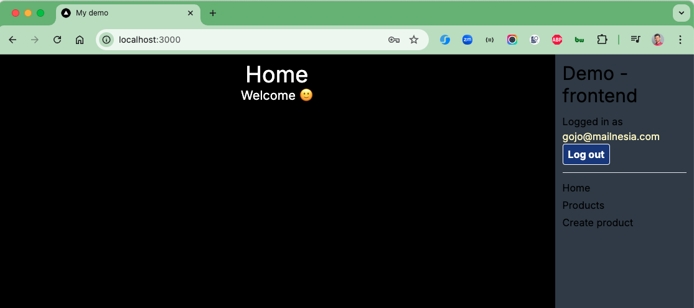
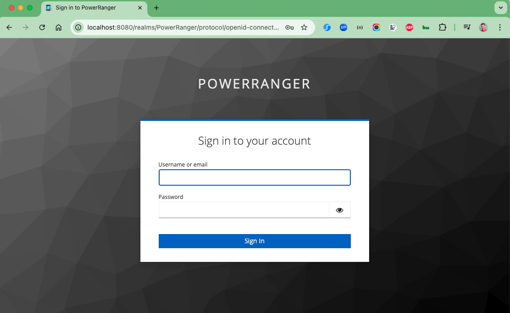
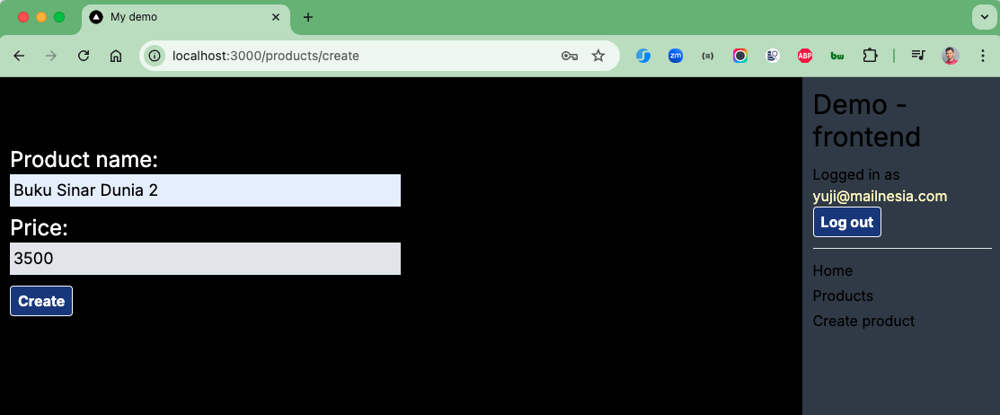
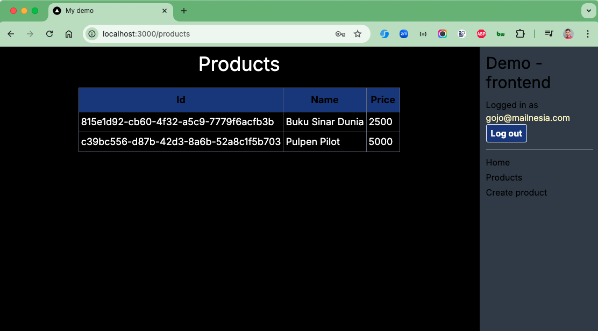
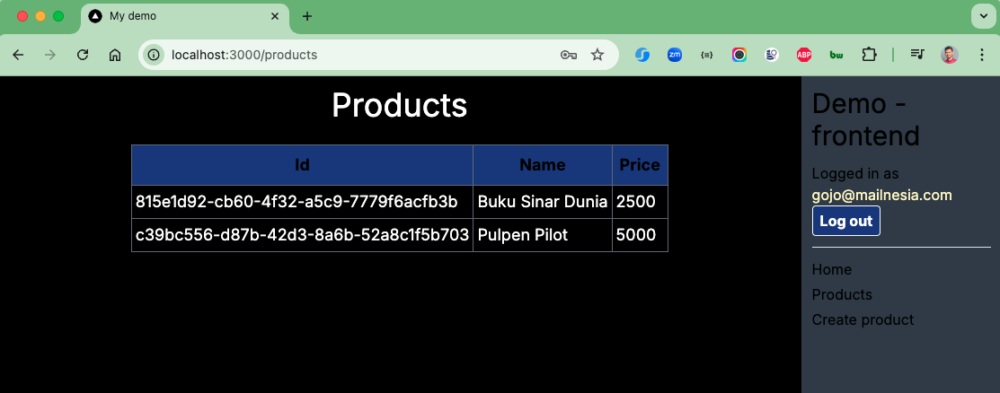
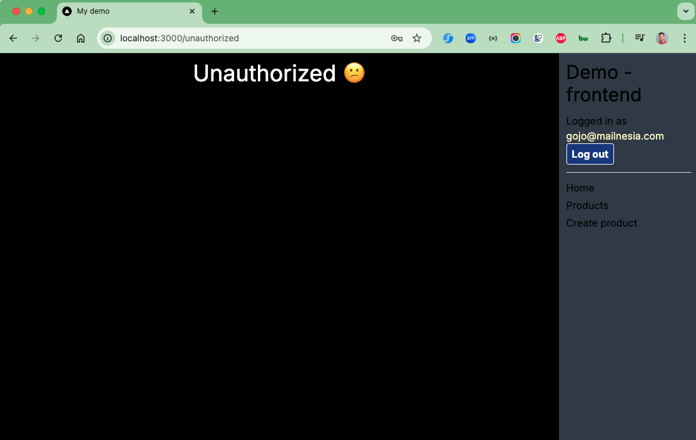

# Golang Fiber Keycloak NextJS 14

## Keycloak

Keycloak is an open-source identity and access management (IAM) solution developed by Red Hat. It provides features for
securing applications and services with minimal effort, enabling developers to manage authentication and authorization
centrally. Here are some key features and concepts associated with Keycloak:

### Centralized User Management

Keycloak allows you to centralize user management in one place, making it easier to manage users, roles, and permissions
across multiple applications and services. It supports user federation, which means you can integrate it with existing
user directories, such as LDAP or Active Directory.

### Single Sign-On (SSO) and Single Log-Out

One of the most significant features of Keycloak is its support for Single Sign-On (SSO). SSO enables users to log in
once and gain access to multiple applications without being prompted to log in again at each of them. Similarly, Single
Log-Out allows users to log out from all applications simultaneously.

### Social Login

Keycloak supports social login, allowing users to sign in using their social media accounts such as Google, Facebook,
Twitter, etc. This feature enhances the user experience by simplifying the registration and login processes.

### Multi-factor Authentication (MFA)

For enhanced security, Keycloak supports Multi-factor Authentication (MFA). This adds an extra layer of security by
requiring users to provide two or more verification factors to gain access to an application.

### OpenID Connect (OIDC) and SAML

Keycloak implements modern protocols like OpenID Connect (OIDC) and SAML 2.0 for authentication and authorization,
making it versatile and compatible with a wide range of applications.

### Customizable Themes

The look and feel of the login pages served by Keycloak can be customized according to your branding requirements.
Keycloak allows for theme customizations where you can change the appearance of the login, registration, and account
management pages.

### Administration Console

Keycloak comes with an easy-to-use web-based administration console for managing realms, users, roles, and permissions.
A realm in Keycloak is a space where you manage your users, credentials, roles, and groups.

### Security

Keycloak provides robust security features out of the box, including SSL/TLS, password policies, brute force detection,
and more. It also allows for the secure storage of user credentials.

### API Access Management

Keycloak allows for securing application APIs by using tokens (JWT tokens or SAML assertions). It makes it easy to
define which resources are secured and which roles or clients have access to them.

### Scalability and High Availability

Keycloak is designed to be scalable and can be deployed in a high-availability configuration to ensure that
authentication services are always available to users and applications.

### Typical Use Cases

* Enterprise Applications: Organizations use Keycloak to manage authentication across a suite of applications, providing
  a seamless and secure user experience.
* Microservices Security: Keycloak can act as a central authentication server in microservices architectures, managing
  access across multiple services.
* APIs and Mobile Apps: Keycloak is used to secure APIs and mobile applications by issuing and verifying tokens.

### How It Works

* **Realms**: A realm in Keycloak is a space where you manage a set of users, credentials, roles, and groups. A realm
  manages everything related to identity management.

* **Client**s: Applications and services that want to use Keycloak for authentication are called clients. Clients can be
  configured to use different protocols (OAuth2, SAML, etc.).

* **Roles:** Roles define permissions within a realm. They can be assigned to users or groups to control access to
  applications.

* **Groups**: Users can be grouped into groups, and roles can be assigned to groups to manage permissions collectively.

* **Identi**ty Providers: Keycloak can be configured to authenticate users from external identity providers like Google,
  Facebook, or corporate identity providers via SAML or LDAP.

### Why Use Keycloak?

Keycloak simplifies the process of managing user authentication and authorization, especially in scenarios involving
multiple applications or services. By providing a centralized system for managing user identities and access control, it
reduces the burden on individual applications to handle security and helps ensure consistent security practices across
an organization.

### Things todo list

1. Clone this repository: `git clone https://github.com/hendisantika/go-fiber-keycloak-nextjs.git`
2. Navigate to the folder: `cd go-fiber-keycloak-nextjs`
3. Navigate to the backend: `cd backend`
4. Run Backend project: `go run main.go`
5. Navigate to the frontend: `cd frontend`
6. Run Frontend project: `pnpm install && pnpm dev`
7. Open your favorite browser: http://localhost:3000
8. Navigate to docker folder: `cd docker`
9. Run docker compose: `docker compose -f compose2.yml up`

### Image Screenshots

Home Page

Keycloak Login

Create Product Page

List Products Page

Unauthorize Page

